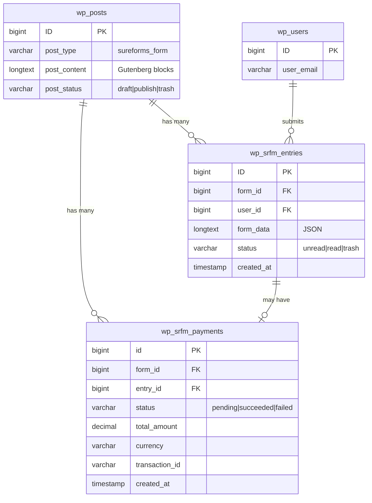

# SureForms Database Schema

> **Purpose:** Document custom database tables, WordPress post types, and data migration strategies
> **Audience:** Backend developers, database administrators
> **Last Updated:** 2026-02-06
> **Plugin Version:** 2.5.0

## Overview

SureForms uses a **hybrid data storage approach** combining WordPress native tables with custom optimized tables:

1. **WordPress Custom Post Type (`sureforms_form`)** - Form configurations and structure
2. **Custom Table (`wp_srfm_entries`)** - Form submission data (performance-optimized)
3. **Custom Table (`wp_srfm_payments`)** - Payment transaction tracking

**Why Custom Tables?**
- **Performance:** Separate from WordPress posts/postmeta tables (millions of rows)
- **Query Optimization:** Custom indexes for form-specific queries
- **Data Integrity:** Structured schema with foreign keys
- **Scalability:** Handle large volumes of form submissions efficiently

---

## Custom Tables

### Table: `wp_srfm_entries`

**Purpose:** Store form submission data separate from WordPress posts for optimized query performance.

**Schema Definition:** [inc/database/tables/entries.php](../../inc/database/tables/entries.php)
**Table Version:** 1
**Character Set:** utf8mb4_unicode_ci

#### SQL Schema

```sql
CREATE TABLE wp_srfm_entries (
    ID BIGINT(20) UNSIGNED AUTO_INCREMENT PRIMARY KEY,
    form_id BIGINT(20) UNSIGNED,
    user_id BIGINT(20) UNSIGNED NOT NULL DEFAULT 0,
    form_data LONGTEXT,
    logs LONGTEXT,
    notes LONGTEXT,
    submission_info LONGTEXT,
    status VARCHAR(10),
    type VARCHAR(20),
    extras LONGTEXT,
    created_at TIMESTAMP NOT NULL DEFAULT CURRENT_TIMESTAMP,
    updated_at TIMESTAMP NOT NULL DEFAULT CURRENT_TIMESTAMP ON UPDATE CURRENT_TIMESTAMP,

    INDEX idx_form_id (form_id),
    INDEX idx_user_id (user_id),
    INDEX idx_form_id_created_at_status (form_id, created_at, status)
) ENGINE=InnoDB DEFAULT CHARSET=utf8mb4 COLLATE=utf8mb4_unicode_ci;
```

#### Column Descriptions

| Column | Type | Nullable | Default | Description |
|--------|------|----------|---------|-------------|
| `ID` | BIGINT(20) UNSIGNED | No | AUTO_INCREMENT | Primary key, unique entry identifier |
| `form_id` | BIGINT(20) UNSIGNED | No | - | Foreign key to wp_posts.ID (sureforms_form post type) |
| `user_id` | BIGINT(20) UNSIGNED | No | 0 | Foreign key to wp_users.ID (0 for guest submissions) |
| `form_data` | LONGTEXT | Yes | NULL | JSON-encoded submission data (field values) |
| `logs` | LONGTEXT | Yes | NULL | JSON-encoded activity logs array |
| `notes` | LONGTEXT | Yes | NULL | JSON-encoded admin notes array |
| `submission_info` | LONGTEXT | Yes | NULL | JSON-encoded metadata (IP, browser, device, referrer) |
| `status` | VARCHAR(10) | Yes | 'unread' | Entry status: 'unread', 'read', 'trash' |
| `type` | VARCHAR(20) | Yes | NULL | Form type: 'quiz', 'standard', NULL (standard default) |
| `extras` | LONGTEXT | Yes | NULL | JSON-encoded additional data |
| `created_at` | TIMESTAMP | No | CURRENT_TIMESTAMP | Entry creation timestamp |
| `updated_at` | TIMESTAMP | No | CURRENT_TIMESTAMP ON UPDATE | Last modification timestamp |

#### Indexes

**Purpose:** Optimize query performance for common access patterns

| Index Name | Columns | Type | Purpose |
|------------|---------|------|---------|
| PRIMARY | ID | PRIMARY KEY | Unique entry lookup |
| idx_form_id | form_id | INDEX | Filter entries by form |
| idx_user_id | user_id | INDEX | Filter entries by user |
| idx_form_id_created_at_status | form_id, created_at, status | COMPOSITE INDEX | Optimize form dashboard queries with date/status filters |

**Index Usage Examples:**
```sql
-- Uses idx_form_id index
SELECT * FROM wp_srfm_entries WHERE form_id = 123;

-- Uses idx_form_id_created_at_status composite index
SELECT * FROM wp_srfm_entries
WHERE form_id = 123
  AND status = 'unread'
  AND created_at > '2026-01-01'
ORDER BY created_at DESC;
```

#### JSON Column Structures

**form_data** (LONGTEXT, JSON):
```json
{
    "field_slug": {
        "value": "user input",
        "label": "Field Label",
        "type": "text"
    },
    "email": {
        "value": "user@example.com",
        "label": "Email Address",
        "type": "email"
    },
    "phone": {
        "value": "+1234567890",
        "label": "Phone Number",
        "type": "phone"
    }
}
```

**submission_info** (LONGTEXT, JSON):
```json
{
    "ip_address": "192.168.1.1",
    "user_agent": "Mozilla/5.0 (Macintosh; Intel Mac OS X 10_15_7)...",
    "browser": "Chrome",
    "browser_version": "120.0.0.0",
    "device": "Desktop",
    "os": "Mac OS X",
    "referrer": "https://example.com/landing-page",
    "timestamp": 1706800000
}
```

**logs** (LONGTEXT, JSON):
```json
[
    {
        "title": "Entry Created",
        "messages": ["Entry submitted successfully"],
        "timestamp": "2026-02-06 10:30:00"
    },
    {
        "title": "Email Sent",
        "messages": [
            "Notification sent to admin@example.com",
            "User confirmation sent to user@example.com"
        ],
        "timestamp": "2026-02-06 10:30:05"
    },
    {
        "title": "Integration Triggered",
        "messages": ["Data sent to MailChimp", "Subscriber added successfully"],
        "timestamp": "2026-02-06 10:30:10"
    }
]
```

**notes** (LONGTEXT, JSON):
```json
[
    {
        "note": "Follow up required",
        "author": "admin",
        "timestamp": "2026-02-06 12:00:00"
    }
]
```

**extras** (LONGTEXT, JSON):
```json
{
    "quiz_score": 85,
    "quiz_result": "passed",
    "conversational_form": true,
    "utm_source": "google",
    "utm_campaign": "summer_2026"
}
```

#### Status Values

| Status | Description |
|--------|-------------|
| `unread` | New submission, not yet viewed by admin (default) |
| `read` | Admin has viewed the submission |
| `trash` | Soft-deleted, can be restored or permanently deleted |

#### Type Values

| Type | Description |
|------|-------------|
| NULL or `standard` | Regular form submission (default) |
| `quiz` | Quiz form submission with score/results |
| Other custom types | Extensible for future form types |

#### Migration History

**Version 1:**
- **Renamed Column:** `user_data` → `form_data` (v0.0.13)
  - Reason: More descriptive name
  - Migration: ALTER TABLE RENAME COLUMN
  - Backward compatibility: Old queries updated

- **Added Columns:**
  - `type` VARCHAR(20) (v0.0.13)
  - `extras` LONGTEXT (v0.0.13)
  - `user_id` BIGINT(20) (v0.0.13)

---

### Table: `wp_srfm_payments`

**Purpose:** Store payment transaction records for Stripe integration and payment tracking.

**Schema Definition:** [inc/database/tables/payments.php](../../inc/database/tables/payments.php)
**Table Version:** 1
**Character Set:** utf8mb4_unicode_ci

#### SQL Schema

```sql
CREATE TABLE wp_srfm_payments (
    id BIGINT(20) UNSIGNED AUTO_INCREMENT PRIMARY KEY,
    form_id BIGINT(20) UNSIGNED,
    block_id VARCHAR(255) NOT NULL,
    status VARCHAR(50) NOT NULL,
    total_amount DECIMAL(26,8) NOT NULL,
    refunded_amount DECIMAL(26,8) NOT NULL,
    currency VARCHAR(10) NOT NULL,
    entry_id BIGINT(20) UNSIGNED NOT NULL,
    gateway VARCHAR(20) NOT NULL,
    type VARCHAR(30) NOT NULL,
    mode VARCHAR(20) NOT NULL,
    transaction_id VARCHAR(50) NOT NULL,
    customer_id VARCHAR(50) NOT NULL,
    subscription_id VARCHAR(50) NOT NULL,
    subscription_status VARCHAR(20) NOT NULL,
    parent_subscription_id BIGINT(20) UNSIGNED NOT NULL DEFAULT 0,
    payment_data LONGTEXT,
    extra LONGTEXT,
    log LONGTEXT,
    created_at TIMESTAMP NOT NULL DEFAULT CURRENT_TIMESTAMP,
    updated_at TIMESTAMP NOT NULL DEFAULT CURRENT_TIMESTAMP ON UPDATE CURRENT_TIMESTAMP,
    srfm_txn_id VARCHAR(100) NOT NULL,
    customer_email VARCHAR(255) NOT NULL,
    customer_name VARCHAR(255) NOT NULL
) ENGINE=InnoDB DEFAULT CHARSET=utf8mb4 COLLATE=utf8mb4_unicode_ci;
```

#### Column Descriptions

| Column | Type | Nullable | Default | Description |
|--------|------|----------|---------|-------------|
| `id` | BIGINT(20) UNSIGNED | No | AUTO_INCREMENT | Primary key, unique payment identifier |
| `form_id` | BIGINT(20) UNSIGNED | No | - | Foreign key to wp_posts.ID (form) |
| `block_id` | VARCHAR(255) | No | '' | Block client ID (unique identifier for payment field) |
| `status` | VARCHAR(50) | No | 'pending' | Payment status (Stripe-specific) |
| `total_amount` | DECIMAL(26,8) | No | 0.00000000 | Total amount after discount (8 decimal precision) |
| `refunded_amount` | DECIMAL(26,8) | No | 0.00000000 | Total refunded amount |
| `currency` | VARCHAR(10) | No | '' | ISO 4217 currency code (USD, EUR, GBP, etc.) |
| `entry_id` | BIGINT(20) UNSIGNED | No | 0 | Foreign key to wp_srfm_entries.ID |
| `gateway` | VARCHAR(20) | No | '' | Payment gateway ('stripe') |
| `type` | VARCHAR(30) | No | '' | Payment type: 'payment', 'subscription', 'renewal' |
| `mode` | VARCHAR(20) | No | '' | Payment mode: 'test' or 'live' |
| `transaction_id` | VARCHAR(50) | No | '' | Gateway transaction ID (e.g., Stripe pi_xxx) |
| `customer_id` | VARCHAR(50) | No | '' | Gateway customer ID (e.g., Stripe cus_xxx) |
| `subscription_id` | VARCHAR(50) | No | '' | Gateway subscription ID (e.g., Stripe sub_xxx) |
| `subscription_status` | VARCHAR(20) | No | '' | Subscription status ('active', 'canceled', etc.) |
| `parent_subscription_id` | BIGINT(20) UNSIGNED | No | 0 | Parent subscription payment ID (for renewal payments) |
| `payment_data` | LONGTEXT | Yes | NULL | JSON-encoded gateway-specific data |
| `extra` | LONGTEXT | Yes | NULL | JSON-encoded additional metadata |
| `log` | LONGTEXT | Yes | NULL | JSON-encoded payment activity logs |
| `created_at` | TIMESTAMP | No | CURRENT_TIMESTAMP | Payment creation timestamp |
| `updated_at` | TIMESTAMP | No | CURRENT_TIMESTAMP ON UPDATE | Last update timestamp |
| `srfm_txn_id` | VARCHAR(100) | No | '' | SureForms transaction ID (custom format) |
| `customer_email` | VARCHAR(255) | No | '' | Customer email address |
| `customer_name` | VARCHAR(255) | No | '' | Customer full name |

#### Valid Enum Values

**Payment Status** (Stripe-specific):
- `pending` - Payment initiated but not completed
- `succeeded` - Payment completed successfully
- `failed` - Payment failed
- `canceled` - Payment canceled by user or admin
- `requires_action` - Requires additional authentication (3D Secure)
- `requires_payment_method` - Payment method needs to be provided
- `processing` - Payment is being processed
- `refunded` - Full refund processed
- `partially_refunded` - Partial refund processed

**Currency Codes** (ISO 4217):
```
USD, EUR, GBP, JPY, CAD, AUD, CHF, CNY, SEK, NZD,
MXN, SGD, HKD, NOK, TRY, RUB, INR, BRL, ZAR, KRW
```

**Payment Gateway:**
- `stripe` (currently only Stripe supported)

**Payment Mode:**
- `test` - Test/sandbox mode
- `live` - Production mode

**Subscription Status** (Stripe-specific):
- `active` - Subscription is active
- `canceled` - Subscription canceled
- `past_due` - Payment failed, retrying
- `unpaid` - Payment failed, no retry
- `trialing` - In trial period
- `incomplete` - Initial payment not completed
- `incomplete_expired` - Initial payment window expired
- `paused` - Subscription paused

#### JSON Column Structures

**payment_data** (LONGTEXT, JSON):
```json
{
    "stripe_payment_intent": {
        "id": "pi_1234567890",
        "amount": 4999,
        "currency": "usd",
        "status": "succeeded",
        "created": 1706800000
    },
    "refunds": {
        "re_1234567890": {
            "refund_id": "re_1234567890",
            "amount": 1000,
            "status": "succeeded",
            "created": 1706900000,
            "reason": "requested_by_customer"
        }
    }
}
```

**extra** (LONGTEXT, JSON):
```json
{
    "discount_code": "SUMMER2026",
    "discount_amount": 10.00,
    "original_amount": 59.99,
    "tax_amount": 5.00,
    "metadata": {
        "utm_source": "google",
        "utm_campaign": "summer_sale"
    }
}
```

**log** (LONGTEXT, JSON):
```json
[
    {
        "title": "Payment Initiated",
        "message": "Stripe Payment Intent created",
        "timestamp": "2026-02-06 10:30:00"
    },
    {
        "title": "Payment Succeeded",
        "message": "Payment completed successfully",
        "timestamp": "2026-02-06 10:30:15"
    }
]
```

---

## WordPress Custom Post Type

### Post Type: `sureforms_form`

**Purpose:** Store form configurations and structure using WordPress's content management system.

**Registration:** [inc/post-types.php](../../inc/post-types.php)
**Supports:** title, editor, custom-fields
**Public:** false (admin-only)
**Has Archive:** false
**Rewrite:** false

#### Post Fields

| Field | Type | Description |
|-------|------|-------------|
| `post_title` | VARCHAR(200) | Form name (user-editable) |
| `post_content` | LONGTEXT | Serialized Gutenberg blocks (form structure) |
| `post_status` | VARCHAR(20) | 'draft', 'publish', 'trash' |
| `post_type` | VARCHAR(20) | 'sureforms_form' (constant) |
| `post_author` | BIGINT(20) | WordPress user ID who created the form |
| `post_date` | DATETIME | Form creation date |
| `post_modified` | DATETIME | Last modification date |

#### Post Meta Keys

Form-specific settings stored in `wp_postmeta`:

| Meta Key | Description | Data Type | Example |
|----------|-------------|-----------|---------|
| `_srfm_form_settings` | General form settings | Serialized array | [complex settings object] |
| `_srfm_email_notifications` | Email notification rules | Serialized array | Multiple notification configs |
| `_srfm_confirmation_settings` | Post-submission behavior | Serialized array | Message or redirect URL |
| `_srfm_spam_protection` | Anti-spam settings | Serialized array | reCAPTCHA, honeypot config |
| `_srfm_gdpr_settings` | GDPR compliance options | Serialized array | Consent, auto-delete rules |
| `_srfm_styling_settings` | Form visual customization | Serialized array | Colors, fonts, spacing |
| `_srfm_conditional_logic` | Conditional field display | Serialized array | Field visibility rules |
| `_srfm_integrations_webhooks` | Third-party integrations | Serialized array | MailChimp, webhooks |
| `_srfm_instant_form_settings` | Instant form configuration | Serialized array | AI-generated form data |
| `_srfm_conversational_form` | Conversational mode settings | Serialized array | Step-by-step form config |
| `_srfm_premium_common` | Pro features settings | Serialized array | Pro-only configurations |
| `_srfm_user_registration_settings` | User registration integration | Serialized array | Create user on submission |

#### Block Structure (post_content)

Forms stored as serialized Gutenberg blocks (HTML comments):

```html
<!-- wp:sureforms/sform {"formId":123} -->
    <!-- wp:sureforms/input {
        "slug":"name",
        "label":"Full Name",
        "required":true,
        "placeholder":"Enter your name"
    } /-->

    <!-- wp:sureforms/email {
        "slug":"email",
        "label":"Email Address",
        "required":true,
        "placeholder":"you@example.com"
    } /-->

    <!-- wp:sureforms/textarea {
        "slug":"message",
        "label":"Message",
        "required":false,
        "placeholder":"Your message here..."
    } /-->

    <!-- wp:sureforms/payment {
        "slug":"payment",
        "amount":49.99,
        "currency":"USD",
        "gateway":"stripe"
    } /-->
<!-- /wp:sureforms/sform -->
```

---

## Database Schema Migrations

### Version Control System

**Implementation:** Each table class maintains a `$table_version` property.

**Version Storage:** WordPress options table
```
Option Name: srfm_entries_version
Option Value: 1 (integer)

Option Name: srfm_payments_version
Option Value: 1 (integer)
```

### Migration Flow

```
1. Plugin loads → Database\Register::init()
2. For each table:
   a. Get stored version from wp_options
   b. Compare with code version ($table_version)
   c. If mismatch: run upgrade() method
   d. Execute schema changes
   e. Update version in wp_options
```

### Migration Methods

**Base Class Methods** ([inc/database/base.php](../../inc/database/base.php)):

| Method | Purpose |
|--------|---------|
| `maybe_create_table()` | Create table if not exists |
| `maybe_add_new_columns()` | Add new columns to existing table |
| `maybe_rename_columns()` | Rename columns (e.g., user_data → form_data) |
| `upgrade($old_version)` | Custom migration logic per version |

### Adding a New Column (Example)

**Step 1:** Increment table version in table class
```php
// In inc/database/tables/entries.php
protected $table_version = 2;  // Increment from 1 to 2
```

**Step 2:** Add column to schema
```php
public function get_schema() {
    return [
        // ... existing columns
        'new_column' => [
            'type'    => 'string',
            'default' => '',
        ],
    ];
}
```

**Step 3:** Add column definition
```php
public function get_new_columns_definition() {
    return [
        'new_column VARCHAR(255) DEFAULT "" AFTER status',
    ];
}
```

**Step 4:** Implement upgrade logic (if needed)
```php
public function upgrade($old_version) {
    global $wpdb;

    if ($old_version < 2) {
        // Additional migration logic beyond column addition
        $wpdb->query("UPDATE {$this->table_name} SET new_column = 'default_value'");
    }
}
```

### Migration Best Practices

1. **Never Delete Columns** - Mark as deprecated instead
   ```php
   // DON'T: ALTER TABLE DROP COLUMN old_column
   // DO: Leave column, document as deprecated
   ```

2. **Always Provide Defaults** - Avoid NULL for new columns
   ```php
   'new_column VARCHAR(255) DEFAULT ""'  // Good
   'new_column VARCHAR(255)'             // Bad (no default)
   ```

3. **Test with Production Data** - Use staging environment first
4. **Log All Migrations** - Use error_log() for debugging
5. **Backwards Compatible** - Old code must work during migration
6. **Atomic Operations** - Use transactions where possible

---

## Common Query Patterns

### Get All Entries for a Form

```php
use SRFM\Inc\Database\Tables\Entries;

$entries = Entries::get_all([
    'where' => [
        [
            ['key' => 'form_id', 'compare' => '=', 'value' => 123],
            ['key' => 'status', 'compare' => '!=', 'value' => 'trash'],
        ]
    ],
    'orderby' => 'created_at',
    'order' => 'DESC',
    'limit' => 20,
    'offset' => 0
]);
```

**Generated SQL:**
```sql
SELECT * FROM wp_srfm_entries
WHERE form_id = 123
  AND status != 'trash'
ORDER BY created_at DESC
LIMIT 0, 20
```

### Get Entry Count by Status

```php
$unread_count = Entries::get_total_entries_by_status('unread', $form_id);
$all_count = Entries::get_total_entries_by_status('all', $form_id);
```

**Generated SQL:**
```sql
-- Unread count
SELECT COUNT(*) FROM wp_srfm_entries
WHERE status = 'unread' AND form_id = 123

-- All count (excluding trash)
SELECT COUNT(*) FROM wp_srfm_entries
WHERE status != 'trash' AND form_id = 123
```

### Get Entries with Payments

```php
global $wpdb;

$entries_with_payments = $wpdb->get_results($wpdb->prepare(
    "SELECT e.*, p.total_amount, p.status as payment_status, p.currency
     FROM {$wpdb->prefix}srfm_entries e
     INNER JOIN {$wpdb->prefix}srfm_payments p ON e.ID = p.entry_id
     WHERE e.form_id = %d
       AND p.status = 'succeeded'
     ORDER BY e.created_at DESC",
    $form_id
));
```

### Get Payments by Status

```php
use SRFM\Inc\Database\Tables\Payments;

$succeeded_payments = Payments::get_all([
    'where' => [
        [
            ['key' => 'form_id', 'compare' => '=', 'value' => 123],
            ['key' => 'status', 'compare' => '=', 'value' => 'succeeded'],
        ]
    ],
    'orderby' => 'created_at',
    'order' => 'DESC'
]);
```

---

## Performance Optimization

### Indexing Strategy

**Why Indexes Matter:**
- 10,000+ entries: ~50ms query time with indexes vs ~500ms without
- Composite indexes optimize multi-column WHERE clauses
- Index order matters: (form_id, created_at, status) ≠ (status, form_id, created_at)

**Index Usage Guidelines:**

1. **Use Indexed Columns in WHERE Clauses**
```php
// GOOD - Uses idx_form_id index
$entries = Entries::get_all(['where' => [[['key' => 'form_id', 'compare' => '=', 'value' => 123]]]]);

// BAD - No index on 'type' column (full table scan)
$entries = Entries::get_all(['where' => [[['key' => 'type', 'compare' => '=', 'value' => 'quiz']]]]);
```

2. **Leverage Composite Indexes**
```php
// GOOD - Uses idx_form_id_created_at_status composite index
$entries = Entries::get_all([
    'where' => [
        [
            ['key' => 'form_id', 'compare' => '=', 'value' => 123],
            ['key' => 'created_at', 'compare' => '>', 'value' => '2026-01-01'],
            ['key' => 'status', 'compare' => '=', 'value' => 'unread'],
        ]
    ]
]);
```

3. **Avoid SELECT ***
```php
// GOOD - Specify columns
$entries = Entries::get_instance()->get_results(
    ['form_id' => 123],
    'ID, form_data, created_at'
);

// BAD - Selects all columns including large LONGTEXT
$entries = Entries::get_all(['where' => [[['key' => 'form_id', 'compare' => '=', 'value' => 123]]]]);
```

### Pagination Best Practices

```php
// Paginate large result sets
$per_page = 20;
$page = 2;
$offset = ($page - 1) * $per_page;

$entries = Entries::get_all([
    'where' => [[['key' => 'form_id', 'compare' => '=', 'value' => 123]]],
    'limit' => $per_page,
    'offset' => $offset,
    'orderby' => 'created_at',
    'order' => 'DESC'
]);

// Cache total count separately
$total = Entries::get_total_entries_by_status('all', 123);
$total_pages = ceil($total / $per_page);
```

### JSON Column Optimization

**MySQL 5.7+ JSON Functions:**
```sql
-- Extract specific field from form_data JSON
SELECT
    ID,
    JSON_EXTRACT(form_data, '$.email.value') as email
FROM wp_srfm_entries
WHERE form_id = 123;

-- Search within JSON
SELECT * FROM wp_srfm_entries
WHERE JSON_EXTRACT(form_data, '$.email.value') = 'user@example.com';
```

**Performance Warning:**
- JSON queries are slower than indexed columns
- Avoid wildcard searches in JSON (`LIKE '%value%'`)
- Consider extracting frequently-queried JSON fields to dedicated columns

---

## Data Retention & GDPR

### Auto-Delete Configuration

**Setting Location:** [inc/single-form-settings/compliance-settings.php](../../inc/single-form-settings/compliance-settings.php)

**Per-Form Settings:**
```php
$retention_days = get_post_meta($form_id, '_srfm_entry_retention_days', true);
// Values: 0 (never delete), 7, 30, 60, 90, 365 (days)
```

**Implementation:** WordPress Cron (Action Scheduler)

```php
// Scheduled task runs daily at 2 AM
add_action('srfm_daily_scheduled_action', 'srfm_auto_delete_entries');

function srfm_auto_delete_entries() {
    global $wpdb;

    // Get forms with auto-delete enabled
    $forms = $wpdb->get_results("
        SELECT post_id, meta_value as retention_days
        FROM {$wpdb->postmeta}
        WHERE meta_key = '_srfm_entry_retention_days'
          AND meta_value > 0
    ");

    foreach ($forms as $form) {
        $cutoff_date = date('Y-m-d H:i:s', strtotime("-{$form->retention_days} days"));

        // Delete entries older than cutoff
        $wpdb->delete(
            $wpdb->prefix . 'srfm_entries',
            [
                'form_id' => $form->post_id,
                'created_at < ' => $cutoff_date
            ]
        );
    }
}
```

### Manual Entry Management

**Soft Delete (Trash):**
```php
Entries::update($entry_id, ['status' => 'trash']);
```

**Permanent Delete:**
```php
// Fires srfm_before_delete_entry hook
Entries::delete($entry_id);
```

**Restore from Trash:**
```php
Entries::update($entry_id, ['status' => 'unread']);
```

---

## Backup & Recovery

### Backup Recommendations

**1. Full Database Backup** (before plugin updates)
```bash
mysqldump -u username -p database_name > sureforms_backup.sql
```

**2. Table-Specific Dumps**
```bash
# Entries table
mysqldump -u username -p database_name wp_srfm_entries > entries_backup.sql

# Payments table
mysqldump -u username -p database_name wp_srfm_payments > payments_backup.sql

# Form configurations (WordPress tables)
mysqldump -u username -p database_name wp_posts wp_postmeta \
  --where="post_type='sureforms_form'" > forms_backup.sql
```

**3. Export Entries via Admin UI**
- Navigate to SureForms → Entries
- Select entries → Export CSV
- Includes all form data and metadata

### Restore Process

```bash
# Restore from backup
mysql -u username -p database_name < entries_backup.sql

# Restore specific table
mysql -u username -p database_name < wp_srfm_entries.sql
```

---

## Troubleshooting

### Issue: Missing Tables

**Symptom:** "Table doesn't exist" errors in PHP logs
**Cause:** Tables not created during activation
**Fix:**
1. Deactivate plugin
2. Delete option: `srfm_entries_version`, `srfm_payments_version`
3. Reactivate plugin (triggers table creation)

### Issue: Charset/Collation Errors

**Symptom:** Garbled text in submissions (emoji, special characters)
**Cause:** Incorrect charset (not utf8mb4)
**Fix:**
```sql
ALTER TABLE wp_srfm_entries
CONVERT TO CHARACTER SET utf8mb4 COLLATE utf8mb4_unicode_ci;

ALTER TABLE wp_srfm_payments
CONVERT TO CHARACTER SET utf8mb4 COLLATE utf8mb4_unicode_ci;
```

### Issue: JSON Parsing Errors

**Symptom:** "Invalid JSON" errors when retrieving form_data
**Cause:** Unescaped quotes in field values
**Fix:**
```php
// Always use wp_json_encode() for JSON storage
$form_data_json = wp_json_encode($form_data);

// Always use json_decode() with error handling
$form_data = json_decode($form_data_json, true);
if (json_last_error() !== JSON_ERROR_NONE) {
    error_log('JSON decode error: ' . json_last_error_msg());
}
```

### Issue: Slow Queries

**Symptom:** Dashboard loads slowly with many entries
**Cause:** Missing indexes or inefficient queries
**Debug:**
```sql
-- Check query execution plan
EXPLAIN SELECT * FROM wp_srfm_entries
WHERE form_id = 123
  AND status = 'unread'
ORDER BY created_at DESC
LIMIT 20;

-- Should show "Using index" in Extra column
```

**Fix:**
1. Ensure indexes exist (check `SHOW INDEX FROM wp_srfm_entries`)
2. Use indexed columns in WHERE clauses
3. Add pagination (LIMIT/OFFSET)

---

## Entity Relationship Diagram



---

## Summary

**Storage Strategy:**
- **Forms:** WordPress custom post type (native CMS benefits)
- **Entries:** Custom table (performance optimization)
- **Payments:** Custom table (financial data tracking)

**Key Design Decisions:**
- Custom tables for scalability (handle millions of entries)
- JSON columns for flexible schema (form fields vary per form)
- Composite indexes for query optimization
- Version-controlled migrations for safe schema updates

**Maintenance:**
- Regular backups before plugin updates
- Monitor table sizes (OPTIMIZE TABLE if needed)
- Review slow query logs
- Test migrations on staging first

---

**Related Documentation:**
- [CLAUDE.md](../../CLAUDE.md) - AI agent guide
- [ARCHITECTURE.md](../02-architecture/ARCHITECTURE.md) - System design
- [CODING-STANDARDS.md](../03-development/CODING-STANDARDS.md) - Code style
- [SECURITY.md](../07-security/SECURITY.md) - Security practices
